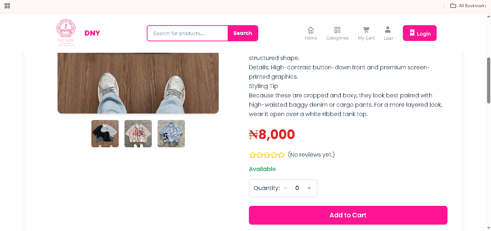
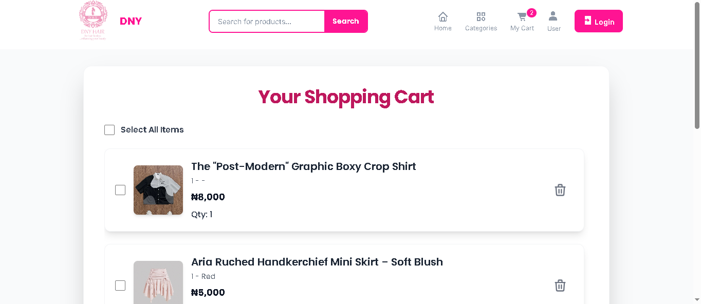
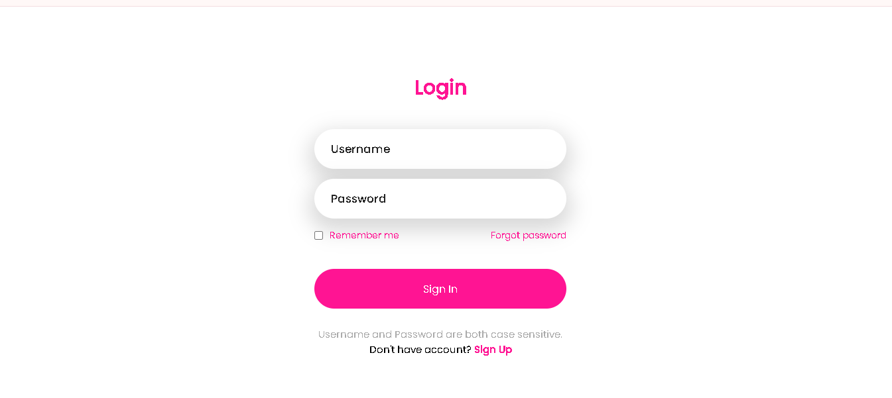
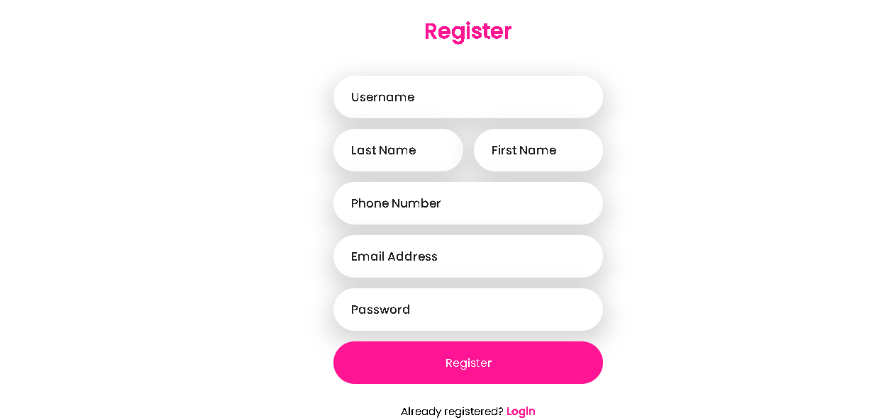
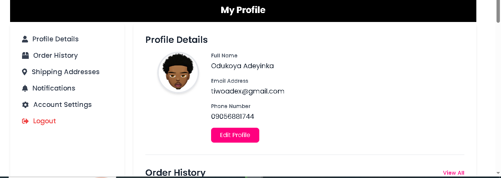
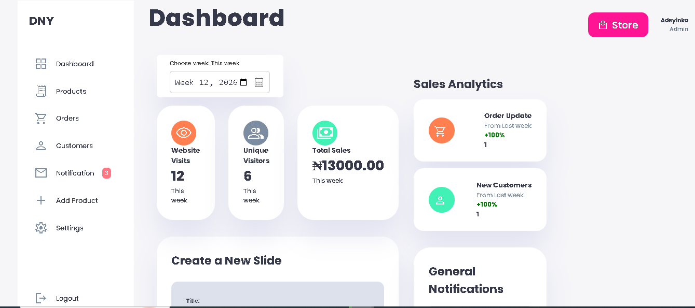

# DNY SmartRetail Platform 🛒

DNY is a full-featured e-commerce platform built with **Django**, designed for both customer shopping experiences and powerful administrative control. It combines an interactive storefront with real-time business insights for managing products, customers, and sales.

## 🚀 Live Demo
[Click here to view](https://dny-dqye.onrender.com/)
---

## 🌟 Advanced Features

### 🛍️ Customer Experience
* **Interactive UI:** Responsive and dynamic landing page for product discovery.
* **Authentication System:** User registration, login, and profile management.
* **Smart Cart & Checkout:** Add to cart, manage items, and complete orders.
* **Order Tracking:** Automatic Transaction ID generation for tracking and pickup.

### 🧠 Administrative Dashboard
* **Sales Intelligence:** Track most sold products and top customers.
* **Inventory Control:** Full product management (Add, Edit, Delete).
* **Customer Supervision:** View users and their purchase activity.
* **Admin Notices:** Push announcements or updates to users.

---

## 📸 Visual Overview

### 🎥 Full System Demo
*(Complete walkthrough of the platform)*

### Customer view






### 🔐 Authentication & User




### 🧠 Admin Dashboard


* watch **Demo.mp4** and other admin functionality in the images files.

---

## 🛠️ Tech Stack

* **Backend:** Django (Python)
* **Frontend:** HTML5, CSS3, JavaScript
* **Database:** SQLite (development) /Supabase PostgreSQL (production)
* **Media Storage:** Cloudinary
* **Payments:** Paystack (Test Mode)

---

## ⚙️ Setup & Installation

1. **Clone the repository:**
```bash
git clone https://github.com/T-I-W-O/dny-online-store.git
cd dny-online-store
```

2. **Install dependencies:**
```bash
pip install -r requirements.txt
```

3. **Create a `.env` file and add the following:**
```env
# =========================
# DJANGO CORE SETTINGS
# =========================

# Secret key for Django (keep this private, never commit real value)
SECRET_KEY=

# Debug mode (True for development, False for production)
DEBUG=

# Allowed hosts (comma-separated domains, e.g. yoursite.com, .onrender.com)
ALLOWED_HOSTS=


# =========================
# DATABASE (SUPABASE)
# =========================

# Full database URL (optional if using individual fields below)
DATABASE_URL=

# Supabase PostgreSQL database credentials
DB_NAME=        # Default is usually 'postgres'
DB_USER=        # Format: postgres.<project_ref>
DB_PASSWORD=    # Your Supabase database password
DB_HOST=        # e.g. aws-1-eu-west-1.pooler.supabase.com
DB_PORT=        # Usually 6543 for pooler


# =========================
# DJANGO SUPERUSER (AUTO CREATE)
# =========================

# These are used to automatically create a superuser on deploy if none exists
DJANGO_SU_USERNAME=
DJANGO_SU_EMAIL=
DJANGO_SU_PASSWORD=


# =========================
# PAYSTACK (PAYMENTS)
# =========================

# Paystack API keys for handling payments
PAYSTACK_PUBLIC_KEY=
PAYSTACK_SECRET_KEY=


# =========================
# EMAIL CONFIGURATION
# =========================

# Email address used to send emails (e.g. Gmail or SMTP provider)
EMAIL_HOST_USER=

# Email password or app password (never use your real password directly)
EMAIL_HOST_PASSWORD=


# =========================
# CLOUDINARY (MEDIA STORAGE)
# =========================

# Cloudinary credentials for image/media uploads
CLOUD_NAME=
API_KEY=
API_SECRET=
```

4. **Run migrations:**
```bash
python manage.py migrate
```

5. **Run the server:**
```bash
python manage.py runserver
```

6. Open your browser at `http://127.0.0.1:8000/`

---

## 🔐 Notes

* Admin route has been customized from `/admin` to `/secret` for added security.
* Supabase (PostgreSQL) is used as the production database.
* Cloudinary is used for media storage (already included in requirements).
* Paystack integration is in **Test Mode** (no real transactions).

---

## 📌 Status

- Complete e-commerce system with admin and customer flows
- Payment, analytics, and authentication fully implemented

---

## 🚀 Future Improvements

- Real payment deployment
- Email automation improvements
- Advanced filtering and search
- UI/UX enhancements

